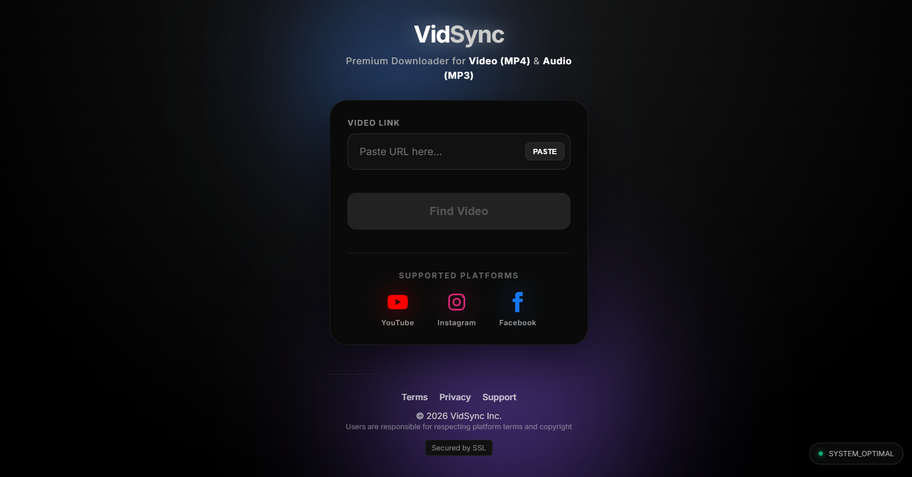

🎥 VidSync - Premium Media Downloader
A sleek, high-performance full-stack web application that allows users to seamlessly download high-quality videos and extract audio from major social media platforms.

🌍 View Live Demo (https://vidfetch.netlify.app/)

📖 Overview
VidSync bridges the gap between complex command-line downloading tools and everyday users. By wrapping the powerful yt-dlp engine in a modern, glass-morphism React interface, VidSync provides a seamless downloading experience.

Users can paste links from YouTube, Instagram, or Facebook, instantly preview the media, choose their desired format (Video or Audio), and track the download progress in real-time. This project demonstrates full-stack architecture, asynchronous data streaming, and robust API design.

📸 

✨ Key Features
🌍 Smart Platform Detection: Automatically identifies and adapts UI for YouTube, Instagram, and Facebook links.

📺 Live Media Previews: Integrated embedded players allow users to preview videos before downloading.

⚙️ Format Flexibility: Seamlessly toggle between high-resolution Video (MP4) and crisp Audio (MP3) extraction.

📊 Real-Time Progress Tracking: Utilizes Server-Sent Events (SSE) to display live download percentages and status updates.

🎨 Modern UI/UX: Features a clean, responsive "glass-morphism" design with animated status widgets.

🛡️ Bot-Bypass Architecture: Backend dynamically spoofs User-Agents and utilizes specific platform clients (like iOS) to prevent throttling and API blocks.

🛠️ Technologies Used
Frontend (Client)
React.js – Component-based UI architecture.

CSS3 – Custom styling, responsive design, and CSS animations.

Axios – Handling asynchronous HTTP requests to the backend API.

EventSource API – Consuming live data streams for the progress bar.

Backend (Server)
Node.js & Express.js – Robust server environment and API routing.

yt-dlp – The core command-line engine for fetching media metadata and downloading files.

Child Process – Spawning and managing background download tasks securely.

🚀 Local Setup & Installation
To run VidSync locally, you need to set up both the backend server and the frontend client. Make sure you have Node.js and yt-dlp installed on your machine.

1. Backend Setup
Open a terminal and navigate to your backend folder.

Install dependencies:

Bash
npm install
Start the Express server (usually runs on port 5000):

Bash
npm start
2. Frontend Setup
Open a new terminal window and navigate to your client folder:

Bash
cd client
Install dependencies:

Bash
npm install
Start the React development server:

Bash
npm run dev
(Or npm start depending on how you initialized your React app).

⚠️ Disclaimer
This application is built for educational purposes and personal use. Users are strictly responsible for ensuring they have the right to download the media they request and must respect the copyright and Terms of Service of the respective platforms.
