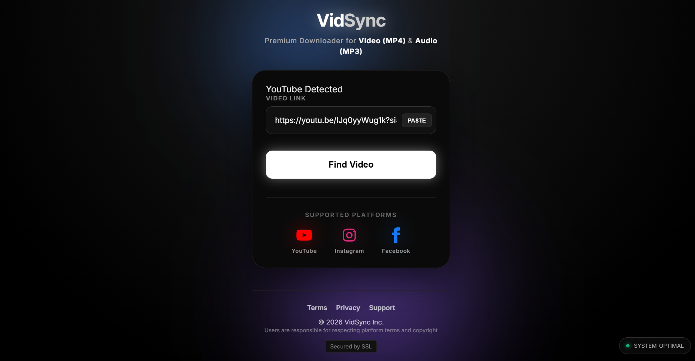

🎥 VidSync – Premium Media Downloader

A sleek, high-performance **full-stack web application** that allows users to seamlessly download high-quality videos and extract audio from major social media platforms.

🌍 **Live Demo:** https://vidfetch.netlify.app/

---
Preview

## 📖 Overview

**VidSync** bridges the gap between powerful command-line media tools and everyday users.

By wrapping the robust **yt-dlp engine** inside a modern **React glass-morphism UI**, VidSync delivers a smooth, intuitive downloading experience.

Users can:

- Paste links from **YouTube, Instagram, or Facebook**
- Instantly preview the media
- Select format (**MP4 Video / MP3 Audio**)
- Track download progress in **real-time**

This project demonstrates:

✔ Full-stack architecture  
✔ Asynchronous task handling  
✔ Server-Sent Events (SSE) streaming  
✔ Process management with Node.js  
✔ Clean UI/UX design  

---

## ✨ Key Features

### 🌍 Smart Platform Detection
Automatically identifies supported platforms and adapts behavior accordingly.

### 📺 Live Media Preview
Embedded preview player before download.

### ⚙️ Flexible Format Selection
Toggle between:

- 🎬 **Video (MP4)**
- 🎵 **Audio (MP3)**

### 📊 Real-Time Progress Tracking
Uses **Server-Sent Events (SSE)** for live updates:

- Download percentage
- Status messages
- Finalization state

### 🎨 Modern UI/UX
Clean glass-morphism design with animated feedback widgets.

### 🛡️ Bot-Bypass Optimizations
Backend dynamically:

- Spoofs User-Agents
- Uses alternate platform clients (e.g., iOS/Android)
- Reduces throttling & extraction failures

---

## 🛠️ Tech Stack

### **Frontend (Client)**
- **React.js** – Component-based UI
- **CSS3** – Custom styling & animations
- **Axios** – API communication
- **EventSource API** – SSE streaming

### **Backend (Server)**
- **Node.js**
- **Express.js**
- **yt-dlp**
- **Child Process API**

---

## 🚀 Local Setup & Installation

### ✅ Prerequisites

Ensure you have installed:

- **Node.js** (v18+ recommended)
- **yt-dlp**
- **FFmpeg** (required for merging/re-encoding)

Check installation:

```bash
node -v
yt-dlp --version
ffmpeg -version
🔧 Backend Setup
cd server
npm install
npm start

Server typically runs on:

http://localhost:5000
🎨 Frontend Setup
cd client
npm install
npm run dev

(or npm start depending on your setup)

Frontend runs on:

http://localhost:5173 / 3000
🔐 Environment Variables (Optional)

Create a .env file inside server/ if needed:

PORT=5000
📡 API Endpoints
Method	Endpoint	Description
POST	/api/video/info	Fetch media metadata
POST	/api/video/download	Start download job
GET	/api/video/progress/:jobId	SSE progress stream
GET	/api/video/file/:jobId	Download final file
🧠 Architecture Highlights

yt-dlp handles extraction & downloading

Child processes isolate downloads

In-memory job queue tracks progress

SSE stream pushes live updates to UI

Automatic cleanup system removes stale jobs/files

⚠️ Disclaimer

VidSync is built strictly for educational and personal use.

Users are responsible for:

Respecting copyright laws

Following platform Terms of Service

Ensuring they have rights to download requested media

This project does not encourage piracy.

📬 Author

Subhra Adhikary
Full-Stack Developer
